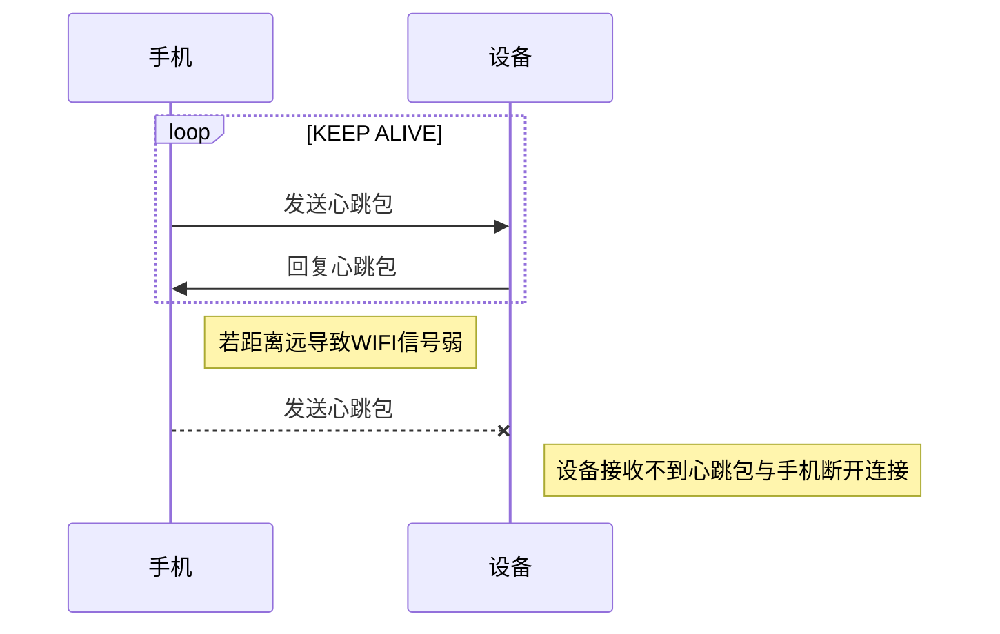
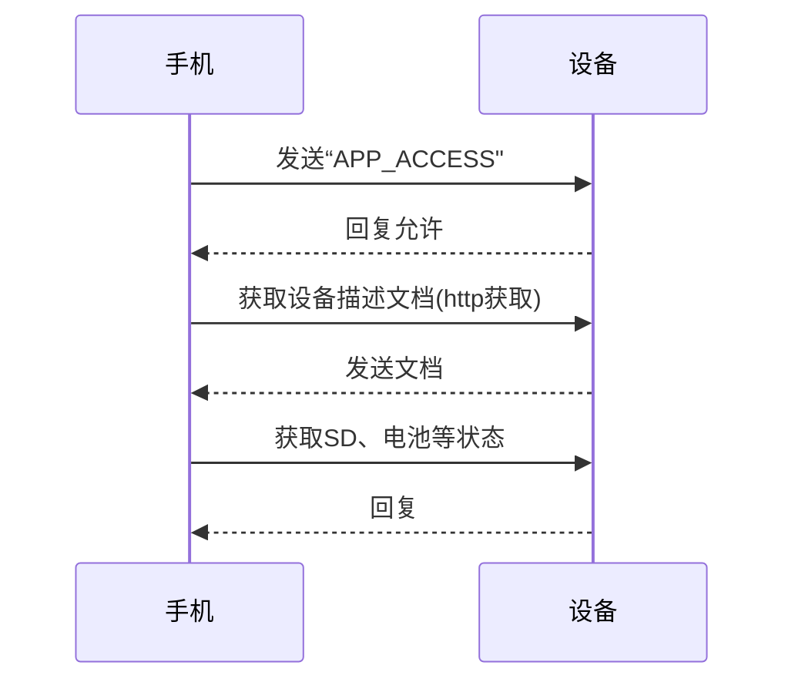
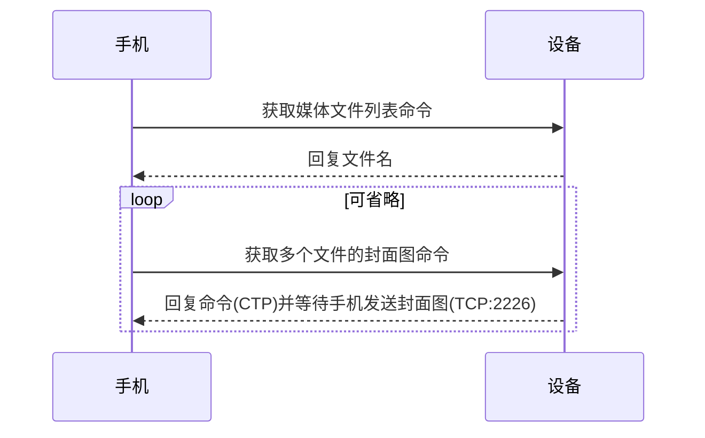
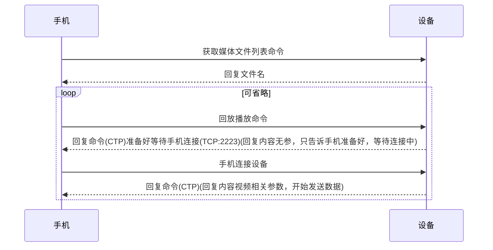
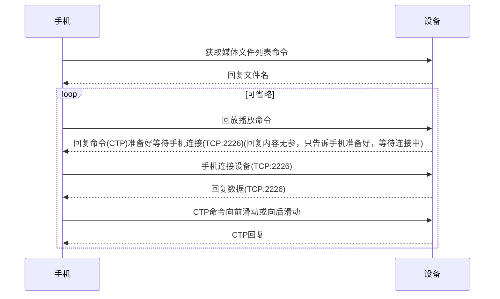

# 前言

      本文档定义了杰理DVRUNNING客户端与杰理AC56行车记录仪/运动DV的通信协议，该协议描述了设备与手机间WIFI连接、接入控制、收发命令、实时流传输、视频下载回看、固件升级等内容。

      AC56行车记录仪/运动DV软件SDK开发人员在进行手机与设备之间的通信联调时可能需要参考本文档，但开发人员不可在设备端软件里随意更改、增加或删减协议的功能，否则有可能会导致设备与手机客户端之间不兼容。如有需求需要修改或删减协议功能，请联系杰理相关负责人进行评估。

      本文档最终解释权归珠海杰理科技股份有限公司。

	  

# 修订记录


| 修订时间 | 修订版本 | 修订人 | 修订描述 |
|--------|--------|--------|--------|
|    2017/02/14    |   V0.1     |    舜坚    |   初稿     |
|    2017/05/24  |   V0.4     |   薛勇    |   修改多文件封面图命令PUT改为GET|
|    2017/05/24  |   V0.4     |   薛勇    |   增加多文件封面图流程|
|    2017/05/24  |   V0.4     |   薛勇    |   修改回放和预览图的数据头定义|
|    2017/06/12  |   V0.4     |   薛勇    |   增加回放流程和修改回放命令|
|    2017/06/12  |   V0.4     |   薛勇    |   修改参数类型命令，数值类不进行映射，如"pro":"30"设置屏保时间30秒|
|    2017/06/12  |   V0.4     |   薛勇    |   修改回放命令秒改为微妙|
|    2017/06/13  |   V0.4     |   薛勇    |   回放流程|
|    2017/06/14  |   V0.4     |   薛勇    |   把dir file 参数改为 path|
|    2017/06/14  |   V0.4     |   薛勇    |   将CUR_FILE_NAME_TYPE改为MEDIA_INFO_TYPE|
|    2017/06/15  |   V0.4     |   薛勇    |   完善文档|
|    2017/06/15  |   V0.4     |   薛勇    |   回放和实时流共用类型|
|    2017/06/15  |   V0.4     |   薛勇    |   增加结束和时间包介绍|
|    2017/06/16  |   V0.4     |   薛勇    |   增加浏览缩略图控制命令和缩略图流程|
|    2017/06/16  |   V0.5     |   薛勇    |   增加CTP错误列表|
|    2017/06/29  |   V0.5     |   薛勇    |   增加快放命令，修改缩略图命令|
|    2017/06/29  |   V0.5     |   薛勇    |   增加缩略图命令|
|    2017/07/04  |   V0.5     |   泽强    |   增加CDP命令通道说明 
|    2017/07/07  |   V0.5     |   薛勇    |   修改返回无参的命令|
|    2017/07/10  |   V0.5     |   薛勇    |   增加碰撞截取流程|
|    2017/07/11  |   V0.5     |   薛勇    |   修改获取文件列表参数|
|    2017/07/19  |   V0.6     |   薛勇    |   增加AP STA 命令|
|    2017/07/22  |   V0.6     |   薛勇    |   修改语言设置命令参数|
|    2017/07/24  |   V0.6     |   薛勇    |   增加碰撞和重力检测命令|
|    2017/07/24  |   V0.6     |   薛勇    |   修改PHOTO_CTRL  VIDEO_CTRL  VIDEO_FINSH命令参数|
|    2017/08/02  |   V0.6     |   薛勇    |   修改回放中结束包，当最后视频增加标记 LAST_VIDEO_MARKER (1 << 7)|
|    2017/08/17  |   V0.6     |   薛勇    |   增加错误类型|
|    2017/08/28  |   V0.7     |   薛勇    |   媒体列表文件vf_list.txt增加区分视频前后文件|
|    2017/08/28  |   V0.7     |   薛勇    |   增加后拉status检测命令|
|    2017/08/30  |   V0.7     |   薛勇    |   增加文件列表改为PUT操作|
|    2017/09/09  |   V0.7     |   薛勇    |   增加碰撞端口和增加文件列表参数|
|    2017/09/19  |   V0.7     |   薛勇    |   增加后拉录像参数设置|
|    2017/09/29  |   V0.8    |   ZDL    |   增加循环保存文件接口|
|    2017/10/19  |   V0.8    |   薛勇    |   增加音频采样率参数|
|    2017/10/19  |   V0.8    |   薛勇    |   修改缩略图流程|
|    2017/10/19  |   V0.8    |   薛勇    |   增加mssdp说明|
|    2017/12/04  |   V0.8    |   薛勇    |   增加开机声音命令|
|    2017/12/19  |   V0.8    |   薛勇    |   增加CDP数据格式|
|    2017/12/19  |   V0.8    |   薛勇    |   增加CDP命令|
|    2018/01/04  |   V0.8    |   薛勇    |   增加通用命令|
|    2018/01/10  |   V0.8    |   薛勇    |   增加media结构成员|
|    2018/05/16  |   V0.8    |   薛勇    |   增加ap sta|

# 目录


[TOC]


## 1 名词解释与约定

### 1.1 名词解释
#### 1.1.1 设备

	  指AC56系列带WIFI行车记录仪或者AC56系列运动DV

#### 1.1.2 手机

	  指安装了DVRUNNING的手机

### 1.2 约定


## 2 协议结构介绍

### 2.1 协议栈结构图


## 3 私有命令协议

### 3.1 协议功能描述

CTP私有命令协议实现于TCP协议层之上，其中IP:192.168.1.1，端口号为==2222==，用于手机和设备命令通信，设备通告手机端事件发生，手机控制设备动作和手机设置设备参数。


### 3.2 协议数据包结构
|            | Identifier | TopicLen | Topic | ContentLen | Content |
|------------|----------|-------|------------|---------|---------|
| Len        | 4Bytes     | 2Bytes   |  nBytes | 4Bytes  |   nBytes  |
| Description | "CTP:"   |   Topic长度  | Topic字符串 | 内容长度  | 内容（json格式）|

### 3.3 命令列表
命令格式如下所示：
```c
{
  "errno":0,        // 错误返回，若无可省略此字段
    "op":"GET", 
	"param":{//操作类型，value0包括“PUT","GET","NOTIFY"
    "key_0":"value1",    // value1-n皆对应相应参数，若无可省略相关字段
    "key_1":"value2",
    "key_2":"value3",
    "key_3":"value4",
    ......
	}
  
}
```
op为操作类型，当手机"PUT"或"GET"命令时，设备统一回复"NOTIFY"。

示例：
Topic: "SD_STATUS"
```c
{
	"errno":0,
    "op":"NOTIFY",
	"prarm":{
		"key_0":"1",        //在线状态（0：离线, 1:在线）
	}    //操作类型（"GET","PUT"）
    
	
}
```

#### 错误列表
```c
#define ENONE         0      // 无错误
#define E_SDCARD      1      // SD卡错误
#define E_SD_OFFLINE  2      // SD卡离线
#define E_ACCESS_RFU  3      // 拒绝访问
#define E_REQUEST     4      // 请求错误
#define E_VER_UMATCH  5      // 版本不匹配
#define E_NO_TOPIC    6      // Topic未实现
#define E_IN_USB      7      // 正处于USB模式
#define E_IN_VIDEO    8      // 正在录像
#define E_IN_BROWSE   9      // 正在浏览模式
#define E_IN_PARKING  10     // 正在停车
#define E_OPEN_FILE   11     // 打开文件失败
#define E_SYS_EXCEP   12     // 系统异常
#define E_SET_PRARM   13     //设置参数失败
#define E_NET_ERR,    14     // 网络异常    
#define CTP_PULL_OFFLINE 15   //   后拉不在线
#define CTP_PULL_NOSUPPORT 16  //后拉不支持
#define CTP_RT_OPEN_FAIL  17  //实时流打开失败
```

#### 3.3.1 心跳包

- 功能描述
用于保持手机和设备间连接，当手机接入到设备端以后，必须在心跳包超时时间内发送心跳包给设备，设备接收到心跳包会立刻返回心跳包给手机。手机可根据设备描述文档获得设备心跳包超时时间。

- 命令描述
Topic："CTP_KEEP_ALIVE",
errno: 参考设备错误列表,
备注：无参数content_len为0

- 命令流程



#### 3.3.2 心跳包间隔
- 功能描述


- 命令描述
Topic:"KEEP_ALIVE_INTERVAL",
errno: 参考设备错误列表,
op: 操作类型("GET", "NOTIFY"),
timeout: 间隔时间（单位：ms）

| 操作类型 | 发送参数说明 | 回复说明|
| ------- |----------- |--------|
| GET| "op":"GET" | "errno":0, "op":"NOTIFY", "param":{"timeout":"60000" }|

- 命令流程


#### 3.3.3 APP访问
- 功能描述
APP每次建立连接，必须发送此Topic给设备。设备根据当前情况允许或拒绝连接。当app接入设备后，设备会主动将心跳包间隔、白平衡、sd卡状态、电池状态等信息发送给app，app根据这些信息进行界面初始化。

- 命令描述
Topic:"APP_ACCESS",
errno: 参考设备错误列表,
op: 操作类型("PUT", "NOTIFY"),
type: 手机类型（0：Android, 1：iOS）
ver: APP版本号

| 操作类型 | 发送参数说明 | 回复说明|
| ------- |----------- |--------|
| PUT | "op":"PUT",  "param":{"type":"0", "ver":"1.0" }| "errno":0, "op":"NOTIFY"|

- 命令流程


#### 3.3.4 SD卡状态
- 功能描述

- 命令描述
Topic: "SD_STATUS"
errno: 参考设备错误列表,
op: 操作类型，“GET” “NOTIFY",
online: 在线状态（0：离线, 1:在线）

| 操作类型 | 发送参数说明 | 回复说明|
| ------- |----------- |--------|
| GET | "op":"GET"| "errno":0, "op":"NOTIFY","param":{ "online":"0" }|
| NOTIFY | "op":"NOTIFY", "param":{ "online":0" }|  |

- 命令流程


#### 3.3.5 电池状态
- 功能描述

- 命令描述
Topic: "BAT_STATUS"
errno: 参考设备错误列表,
op: 操作类型，“GET” “NOTIFY",
level: 电池电量（0：3.7V  1：3.85V  2：4.0V  3：4.05V, 4: 充电中）

| 操作类型 | 发送参数说明 | 回复说明|
| ------- |----------- |--------|
| GET | "op":"GET"| "errno":0, "op":"NOTIFY",  "param":{"level":3 }|
| NOTIFY | "op":"NOTIFY",  "param":{"level":"3"} | "errno":0, "op":"NOTIFY"|

- 命令流程


#### 3.3.6 UUID
- 功能描述
手机获取设备的UUID。

- 命令描述
Topic: "UUID"
errno: 参考设备错误列表,
op: 操作类型("GET", "NOTIFY")
uuid: UUID内容

| 操作类型 | 发送参数说明 | 回复说明|
| ------- |----------- |--------|
| GET | "op":"GET" | "errno":0, "op":"NOTIFY","param":{  "uuid":"112233445566778899"}|

- 命令流程


#### 3.3.7 按键声音
- 功能描述
设置按键声音。

- 命令描述
Topic: "KEY_VOICE"
errno: 参考设备错误列表,
op: 操作类型("GET","PUT","NOTIFY")
kvo: 参数(0: 关,1: 开) 

| 操作类型 | 发送参数说明 | 回复说明|
| ------- |----------- |--------|
| GET | "op":"GET" | "errno":0, "op":"NOTIFY","param":{  "kvo":"0"} |
| PUT | "op":"PUT",  "param":{"kvo":"0"}  | "errno":0, "op":"NOTIFY","param":{  "kvo":"0" }|


#### 3.3.7 开机音效
- 功能描述
设置开机音效。

- 命令描述
Topic: "BOARD_VOICE"
errno: 参考设备错误列表,
op: 操作类型("GET","PUT","NOTIFY")
bvo: 参数(0: 关,1: 开) 

| 操作类型 | 发送参数说明 | 回复说明|
| ------- |----------- |--------|
| GET | "op":"GET" | "errno":0, "op":"NOTIFY","param":{  "bvo":"0"} |
| PUT | "op":"PUT",  "param":{"bvo":"0"}  | "errno":0, "op":"NOTIFY","param":{  "bvo":"0" }|


#### 3.3.8 光源频率
- 功能描述
设置光源频率。

- 命令描述
Topic: "LIGHT_FRE"
errno: 参考设备错误列表,
op: 操作类型("GET","PUT","NOTIFY")
fre: 参数(50 或 60)单位:Hz 

| 操作类型 | 发送参数说明 | 回复说明|
| ------- |----------- |--------|
| GET | "op":"GET" | "errno":0, "op":"NOTIFY", "param":{ "fre":"50" }|
| PUT | "op":"PUT",  "param":{"fre":"50" } | "errno":0, "op":"NOTIFY","param":{  "fre":"50"} |


#### 3.3.9 自动关机
- 功能描述
设置自动关机。

- 命令描述
Topic: "AUTO_SHUTDOWN"
errno: 参考设备错误列表,
op: 操作类型("GET","PUT","NOTIFY")
aff: 状态(0 或 3 或 5 或 10) 单位min

| 操作类型 | 发送参数说明 | 回复说明|
| ------- |----------- |--------|
| GET | "op":"GET" | "errno":0, "op":"NOTIFY","param":{  "aff":"3"} |
| PUT | "op":"PUT", "param":{ "aff":"3" } | "errno":0, "op":"NOTIFY", "param":{ "aff":"3"} |


#### 3.3.10 屏幕保护
- 功能描述
设置屏幕保护。

- 命令描述
Topic: "SCREEN_PRO"
errno: 参考设备错误列表,
op: 操作类型("GET","NOTIFY")
pro: 参数(0   30   60   120)单位sec

| 操作类型 | 发送参数说明 | 回复说明|
| ------- |----------- |--------|
| GET | "op":"GET" | "errno":0, "op":"NOTIFY","param":{  "pro":"30" }|
| PUT | "op":"PUT",  "param":{"pro":"30"}  | "errno":0, "op":"NOTIFY","param":{  "pro":"30" }|


#### 3.3.7 语言设置
- 功能描述
设置语言。

- 命令描述
Topic: "LANGUAGE"
errno: 参考设备错误列表,
op: 操作类型("GET","NOTIFY")
lag: 参数(1:简体中文,2:繁体中文 3:日文 4:韩文 5:英文 6:法文 ) 

| 操作类型 | 发送参数说明 | 回复说明|
| ------- |----------- |--------|
| GET | "op":"GET" | "errno":0, "op":"NOTIFY", "param":{ "lag":"1"} |
| PUT | "op":"PUT", "param":{ "lag":"0" } | "errno":0, "op":"NOTIFY", "param":{ "lag":"1"} |


#### 3.3.11 TV模式
- 功能描述
设置TV模式。

- 命令描述
Topic: "TV_MODE"
errno: 参考设备错误列表,
op: 操作类型("GET","NOTIFY")
tvm: 参数(0:pal,1:ntsc ) 

| 操作类型 | 发送参数说明 | 回复说明|
| ------- |----------- |--------|
| GET | "op":"GET" | "errno":0, "op":"NOTIFY", "param":{ "tvm":"0"} |
| PUT | "op":"PUT", "param":{ "tvm":"0" } | "errno":0, "op":"NOTIFY", "param":{ "tvm":"0"} |


#### 3.3.12 格式化
- 功能描述
设置格式化。

- 命令描述
Topic: "FORMAT"
errno: 参考设备错误列表,
op: 操作类型("PUT ","NOTIFY")
frm: 状态(0:失败,1:成功 ) 

| 操作类型 | 发送参数说明 | 回复说明|
| ------- |----------- |--------|
| PUT | "op":"PUT"| "errno":0, "op":"NOTIFY", "param":{ "frm":"0"} |


#### 3.3.13 TF卡容量
- 功能描述
获取TF卡容量。

- 命令描述
Topic: "TF_CAP"
errno: 参考设备错误列表,
op: 操作类型("GET","NOTIFY")
left: 剩余空间大小(单位为Mb)
total:总空间大小(单位为Mb)

| 操作类型 | 发送参数说明 | 回复说明|
| ------- |----------- |--------|
| GET | "op":"GET" | "errno":0, "op":"NOTIFY", "param":{ "left":"4000","total":"22222"} |


#### 3.3.14 默认设置
- 功能描述录像日期标签
设置默认。

- 命令描述
Topic: "SYSTEM_DEFAULT"
errno: 参考设备错误列表,
op: 操作类型("PUT","GET","NOTIFY")
def: 参数(0:no,1:yes ) 

| 操作类型 | 发送参数说明 | 回复说明|
| ------- |----------- |--------|
| GET | "op":"GET" | "errno":0, "op":"NOTIFY","param":{  "def":"0" }|
| PUT | "op":"PUT", "param":{ "def":"0" } | "errno":0, "op":"NOTIFY", "param":{ "def":"0"} |


#### 3.3.15 录像参数
- 功能描述
手机设置设备录像分辨率和视频格式，及获取设备录像信息（分辨率，视频格式）。

- 命令描述
Topic: "VIDEO_PARAM"
errno: 参考设备错误列表
op: 操作类型("GET","PUT","NOTIFY")
w: 分辨率宽
h: 分辨率高
fps:帧数
rate:音频采样率
format: 视频格式(0:JPEG, 1:H264)

| 操作类型 | 发送参数说明 | 回复说明|
| ------- |----------- |--------|
| GET | "op":"GET" | "errno":0, "op":"NOTIFY","param":{ "w":"1280", "h":"720", "format":"1","fps":"30","rate":"8000"} |
| PUT | "op":"PUT", "param":{ "w":"1280", "h":"720", "format":"1","fps":"30"} | "errno":0, "op":"NOTIFY", "param":{ "w":"1280", "h":"720", "format":"1","fps":"30","rate":"8000"}|


#### 3.3.15 后拉录像参数
- 功能描述
手机设置设备后拉录像分辨率和视频格式，及获取设备录像信息（分辨率，视频格式）。
- 命令描述
Topic: "PULL_VIDEO_PARAM"
errno: 参考设备错误列表
op: 操作类型("GET","PUT","NOTIFY")
w: 分辨率宽
h: 分辨率高
rate:音频采样率
format: 视频格式(0:JPEG, 1:H264)

| 操作类型 | 发送参数说明 | 回复说明|
| ------- |----------- |--------|
| GET | "op":"GET" | "errno":0, "op":"NOTIFY","param":{ "w":"1280", "h":"720", "format":"1","rate":"8000"} |
| PUT | "op":"PUT", "param":{ "w":"1280", "h":"720", "format":"1"} | "errno":0, "op":"NOTIFY", "param":{ "w":"1280", "h":"720", "format":"1","rate":"8000"}|

- 命令流程


#### 3.3.16 录像控制
- 功能描述
手机控制设备启动/关闭录像，及获取设备录像状态。

- 命令描述
Topic: "VIDEO_CTRL"
errno: 参考设备错误列表,
op: 操作类型("GET","PUT","NOTIFY")
status: 状态(0：关闭， 1：打开) 

| 操作类型 | 发送参数说明 | 回复说明|
| ------- |----------- |--------|
| GET | "op":"GET" | "errno":0, "op":"NOTIFY","param":{ "status":"1"}|
| PUT | "op":"PUT", "param":{ "status":"1"} | "errno":0, "op":"NOTIFY","param":{  "status":"1"} |

- 命令流程


#### 3.3.17 录像完成
- 功能描述
录像完成通知APP。

- 命令描述
Topic: "VIDEO_FINISH"
errno: 参考设备错误列表,
op: 操作类型("GET","NOTIFY")
status: 状态(0：关闭， 1：打开) 
desc:文件描述(格式：{\"y\":1,\"f\":\"storage/sd1/C/DCIM/1/vid_115.mov\",\"t\":\"20170724155640\",\"d\":\"5\",\"h\":1080,\"w\":1920,\"p\":30,\"s\":\"346500000\"})
文件列表的格式

| 操作类型 | 发送参数说明 | 回复说明|
| ------- |----------- |--------|
| GET | "op":"GET" | "op":"NOTIFY","param":{"status":"0","desc":"{\"y\":1,\"f\":\"storage/sd1/C/DCIM/1/vid_115.mov\",\"t\":\"20170724155640\",\"d\":\"5\",\"h\":1080,\"w\":1920,\"p\":30,\"s\":\"346500000\"}"}} 

- 命令流程


#### 3.3.18 双路录像
- 功能描述
设置双路录像。

- 命令描述
Topic: "DOUBLE_VIDEO"
errno: 参考设备错误列表,
op: 操作类型("PUT","GET","NOTIFY")
two: 状态(0：off， 1：on) 

| 操作类型 | 发送参数说明 | 回复说明|
| ------- |----------- |--------|
| GET | "op":"GET" | "errno":0, "op":"NOTIFY","param":{  "two":"0" }|
| PUT | "op":"PUT", "param":{ "two":"0"  }| "errno":0, "op":"NOTIFY","param":{  "two":"0" }|


#### 3.3.19 循环录像
- 功能描述
设置循环录像。

- 命令描述
Topic: "VIDEO_LOOP"
errno: 参考设备错误列表,
op: 操作类型("PUT","GET","NOTIFY")
cyc: 状态(0   3    5    10)单位：min

| 操作类型 | 发送参数说明 | 回复说明|
| ------- |----------- |--------|
| GET | "op":"GET" | "errno":0, "op":"NOTIFY","param":{  "cyc":"0"} |
| PUT | "op":"PUT", "param":{ "cyc":"0" } | "errno":0, "op":"NOTIFY", "param":{ "cyc":"0"} |

#### 3.3.20 夜视增强
- 功能描述
设置夜视增强。

- 命令描述
Topic: "VIDEO_WDR"
errno: 参考设备错误列表,
op: 操作类型("PUT","GET","NOTIFY")
wdr: 状态(0：关闭， 1：打开) 

| 操作类型 | 发送参数说明 | 回复说明|
| ------- |----------- |--------|
| GET | "op":"GET" | "errno":0, "op":"NOTIFY", "param":{ "wdr":"0" }|
| PUT | "op":"PUT",  "param":{"wdr":"0" } | "errno":0, "op":"NOTIFY", "param":{ "wdr":"0"} |


                                                                                                                                              
#### 3.3.21 曝光补偿
- 功能描述
设置曝光补偿。

- 命令描述
Topic: "VIDEO_EXP"
errno: 参考设备错误列表,
op: 操作类型("PUT","GET","NOTIFY")
exp: 参数(3 ~ -3)间隔:1


| 操作类型 | 发送参数说明 | 回复说明|
| ------- |----------- |--------|
| GET | "op":"GET" | "errno":0, "op":"NOTIFY","param":{  "exp":"3"} |
| PUT | "op":"PUT", "param":{ "exp":"3"}  | "errno":0, "op":"NOTIFY", "param":{ "exp":"3"} |


#### 3.3.22 移动侦测
- 功能描述
设置移动侦测。

- 命令描述
Topic: "MOVE_CHECK"
errno: 参考设备错误列表,
op: 操作类型("PUT","GET","NOTIFY")
mot: 状态(0：关闭， 1：打开) 

| 操作类型 | 发送参数说明 | 回复说明|
| ------- |----------- |--------|
| GET | "op":"GET" | "errno":0, "op":"NOTIFY","param":{  "mot":"0"} |
| PUT | "op":"PUT",  "param":{"mot":"0" } | "errno":0, "op":"NOTIFY", "param":{ "mot":"0"} |

#### 3.3.23 录音设置
- 功能描述
设置录音。

- 命令描述
Topic: "VIDEO_MIC"
errno: 参考设备错误列表,
op: 操作类型("PUT","GET","NOTIFY")
mic: 状态(0：关闭， 1：打开) 

| 操作类型 | 发送参数说明 | 回复说明|
| ------- |----------- |--------|
| GET | "op":"GET" | "errno":0, "op":"NOTIFY","param":{  "mic":"0"} |
| PUT | "op":"PUT",  "param":{"mic":"0"}  | "errno":0, "op":"NOTIFY", "param":{ "mic":"0"} |


#### 3.3.24 录像日期标签
- 功能描述
设置日期标签。

- 命令描述
Topic: "VIDEO_DATE"
errno: 参考设备错误列表,
op: 操作类型("PUT","GET","NOTIFY")
dat: 状态(0：关闭， 1：打开) 

| 操作类型 | 发送参数说明 | 回复说明|
| ------- |----------- |--------
| GET | "op":"GET" | "errno":0, "op":"NOTIFY","param":{  "dat":"0"} |
| PUT | "op":"PUT", "param":{ "dat":"0" } | "errno":0, "op":"NOTIFY", "param":{ "dat":"0"} |


#### 3.3.25 车牌设置
- 功能描述
设置车牌。

- 命令描述
Topic: "VIDEO_CAR_NUM"
errno: 参考设备错误列表,
op: 操作类型("PUT","GET","NOTIFY")
num: 状态(0：关闭， 1：打开) 

| 操作类型 | 发送参数说明 | 回复说明|
| ------- |----------- |--------|
| GET | "op":"GET" | "errno":0, "op":"NOTIFY","param":{  "num":"0"} |
| PUT | "op":"PUT",  "param":{"num":"0"}  | "errno":0, "op":"NOTIFY", "param":{ "num":"0"} |


#### 3.3.26 重力感应
- 功能描述
设置重力感应。

- 命令描述
Topic: "GRA_SEN"
errno: 参考设备错误列表,
op: 操作类型("PUT","GET","NOTIFY")
gra: 状态(0:关闭,1:low, 2:med, 3:hig) 

| 操作类型 | 发送参数说明 | 回复说明|
| ------- |----------- |--------|
| GET | "op":"GET" | "errno":0, "op":"NOTIFY", "param":{ "gra":"0" }|
| PUT | "op":"PUT",  "param":{"gra":"0" } | "errno":0, "op":"NOTIFY", "param":{ "gra":"0"} |


#### 3.3.27 停车守卫
- 功能描述
设置停车守卫。

- 命令描述
Topic: "VIDEO_PAR_CAR"
errno: 参考设备错误列表,
op: 操作类型("PUT","GET","NOTIFY")
par: 状态(0：关闭， 1：打开) 

| 操作类型 | 发送参数说明 | 回复说明|
| ------- |----------- |--------|
| GET | "op":"GET" | "errno":0, "op":"NOTIFY","param":{  "par":"0" }|
| PUT | "op":"PUT", "param":{ "par":"0" } | "errno":0, "op":"NOTIFY","param":{  "par":"0"} |


#### 3.3.28 间隔录影
- 功能描述
设置间隔录影。

- 命令描述
Topic: "VIDEO_INV"
errno: 参考设备错误列表,
op: 操作类型("PUT","GET","NOTIFY")
gap: 参数(0  100  200 500) 单位：ms

| 操作类型 | 发送参数说明 | 回复说明|
| ------- |----------- |--------|
| GET | "op":"GET" | "errno":0, "op":"NOTIFY","param":{  "gap":"0"} |
| PUT | "op":"PUT", "param":{ "gap":"0" } | "errno":0, "op":"NOTIFY", "param":{ "gap":"0" }|


#### 3.3.29 拍照分辨率
- 功能描述

- 命令描述
Topic: "PHOTO_RESO"
errno: 参考设备错误列表,
op: 操作类型("GET","PUT","NOTIFY")
res: 拍照分辨率（0:vga, 1:1.3M, 2:2M ,3:3M ,4:5M, 5:8M, 6:10M, 7:12M)


| 操作类型 | 发送参数说明 | 回复说明|
| ------- |----------- |--------|
| GET | "op":"GET" | "errno":0, "op":"NOTIFY", "param":{ "res":"2" }|
| PUT | "op":"PUT", "param":{ "res":"2"}  | "errno":0, "op":"NOTIFY","param":{  "res":"2"} |

- 命令流程


#### 3.3.30 拍照控制
- 功能描述
拍照命令，当设备拍照完成后，会返回照片文件名给APP。

- 命令描述
Topic: "PHOTO_CTRL"
errno: 参考设备错误列表,
op: 操作类型("PUT","NOTIFY")
desc:文件描述(格式：{\"y\":1,\"f\":\"storage/sd1/C/DCIM/1/vid_115.mov\",\"t\":\"20170724155640\",\"d\":\"5\",\"h\":1080,\"w\":1920,\"p\":30,\"s\":\"346500000\"})
文件列表的格式


| 操作类型 | 发送参数说明 | 回复说明|
| ------- |----------- |--------|
| PUT | "op":"PUT" | "op":"NOTIFY","param":{"desc":"{\"y\":1,\"f\":\"storage/sd1/C/DCIM/1/vid_115.mov\",\"t\":\"20170724155640\",\"d\":\"5\",\"h\":1080,\"w\":1920,\"p\":30,\"s\":\"346500000\"}"}|

- 命令流程


#### 3.3.31 设置定时拍照时间
- 功能描述

- 命令描述
Topic: "SELF_TIMER"
errno: 参考设备错误列表,
op: 操作类型("GET","PUT","NOTIFY")
phm: 定时拍照选项(0：关 1：定时2秒 2：定时5秒 3：定时10秒)
timeleft: 定时剩余秒数

| 操作类型 | 发送参数说明 | 回复说明|
| ------- |----------- |--------|
| GET | "op":"GET"| "errno":0, "op":"NOTIFY","param":{  "phm":"1"}|
| PUT | "op":"PUT", "param":{ "phm":"0" }| "errno":0, "op":"NOTIFY", "param":{ "phm":"0"}|

==备注：== 当设置完定时拍照时间时，按下拍照，每秒会回复"errno":0, "op":"NOTIFY", "phm":"1", "timeleft":"1"
- 命令流程


#### 3.3.32 连拍
- 功能描述
设置或获取设备连拍张数。

- 命令描述
Topic: "BURST_SHOT"
errno: 参考设备错误列表,
op: 操作类型("GET","PUT","NOTIFY")
cyt: 连拍张数(0：关  1：开)

| 操作类型 | 发送参数说明 | 回复说明|
| ------- |----------- |--------|
| GET | "op":"GET" | "errno":0, "op":"NOTIFY","param":{  "cyt":"0" }|
| PUT | "op":"PUT",  "param":{"cyt":"1" }| "errno":0, "op":"NOTIFY", "param":{ "cyt":"1"}|


#### 3.3.33 图像质量
- 功能描述
设置图像质量。

- 命令描述
Topic: "PHOTO_QUALITY"
errno: 参考设备错误列表,
op: 操作类型("GET","PUT","NOTIFY")
qua: 质量(0：lo  1：md  2: hi  )

| 操作类型 | 发送参数说明 | 回复说明|
| ------- |----------- |--------|
| GET | "op":"GET" | "errno":0, "op":"NOTIFY", "param":{ "qua":"0" }|
| PUT | "op":"PUT",  "param":{"qua":"1"} | "errno":0, "op":"NOTIFY", "param":{ "qua":"1"}|


#### 3.3.34 图像锐度
- 功能描述
设置图像锐度。

- 命令描述
Topic: "PHOTO_SHARPNESS"
errno: 参考设备错误列表,
op: 操作类型("GET","PUT","NOTIFY")
acu: 锐度(0：lo  1：md  2: hi  )

| 操作类型 | 发送参数说明 | 回复说明|
| ------- |----------- |--------|
| GET | "op":"GET" | "errno":0, "op":"NOTIFY", "param":{ "acu":"0" }|
| PUT | "op":"PUT",  "param":{"acu":"1" }| "errno":0, "op":"NOTIFY", "param":{ "acu":"1"}|


#### 3.3.35 图像白平衡
- 功能描述
设置图像白平衡。

- 命令描述
Topic: "WHITE_BALANCE"
errno: 参考设备错误列表,
op: 操作类型("GET","PUT","NOTIFY")
wbl: 白平衡(0:自动  1:日光  2:阴天  3:钨丝灯  4:荧光灯)

| 操作类型 | 发送参数说明 | 回复说明|
| ------- |----------- |--------|
| GET | "op":"GET" | "errno":0, "op":"NOTIFY", "param":{ "wbl":"0"} |
| PUT | "op":"PUT",  "param":{"wbl":"1"} | "errno":0, "op":"NOTIFY","param":{  "wbl":"1"}|


#### 3.3.36 图像ISO
- 功能描述
设置图像ISO。

- 命令描述
Topic: "PHOTO_ISO"
errno: 参考设备错误列表,
op: 操作类型("GET","PUT","NOTIFY")
iso: 参数(0  100  200  400 )

| 操作类型 | 发送参数说明 | 回复说明|
| ------- |----------- |--------|
| GET | "op":"GET" | "errno":0, "op":"NOTIFY", "param":{ "iso":"100"} |
| PUT | "op":"PUT",  "param":{"iso":"100" }| "errno":0, "op":"NOTIFY","param":{  "iso":"100"}|


#### 3.3.37 曝光补偿
- 功能描述
设置曝光补偿。

- 命令描述
Topic: "PHOTO_EXP"
errno: 参考设备错误列表,
op: 操作类型("PUT","GET","NOTIFY")
exp:曝光参数(+3 ~ -3 )


| 操作类型 | 发送参数说明 | 回复说明|
| ------- |----------- |--------|
| GET | "op":"GET" | "errno":0, "op":"NOTIFY", "param":{ "exp":"0" }|
| PUT | "op":"PUT",  "param":{"exp":"0"}  | "errno":0, "op":"NOTIFY","param":{  "exp":"0"} |


#### 3.3.38 防手抖
- 功能描述
设置防手抖。

- 命令描述
Topic: "ANTI_TREMOR"
errno: 参考设备错误列表,
op: 操作类型("GET","PUT","NOTIFY")
sok: sok(0: off  1: on )

| 操作类型 | 发送参数说明 | 回复说明|
| ------- |----------- |--------|
| GET | "op":"GET" | "errno":0, "op":"NOTIFY", "param":{ "sok":"0" }|
| PUT | "op":"PUT", "param":{ "sok":"1"} | "errno":0, "op":"NOTIFY", "param":{ "sok":"1"}|


#### 3.3.39 照片日期标签
- 功能描述
设置防手抖。

- 命令描述
Topic: "PHOTO_DATE"
errno: 参考设备错误列表,
op: 操作类型("GET","PUT","NOTIFY")
dat: dat(0: off  1: on )

| 操作类型 | 发送参数说明 | 回复说明|
| ------- |----------- |--------|
| GET | "op":"GET" | "errno":0, "op":"NOTIFY","param":{  "dat":"0"} |
| PUT | "op":"PUT",  "param":{"dat":"1" }| "errno":0, "op":"NOTIFY","param":{  "dat":"1"}|


#### 3.3.40 快速预览
- 功能描述
设置快速预览。

- 命令描述
Topic: "FAST_SCA"
errno: 参考设备错误列表,
op: 操作类型("GET","PUT","NOTIFY")
sca: sca( 0  2  5)单位为秒

| 操作类型 | 发送参数说明 | 回复说明|
| ------- |----------- |--------|
| GET | "op":"GET" | "errno":0, "op":"NOTIFY","param":{  "sca":"0"} |
| PUT | "op":"PUT",  "param":{"sca":"1" }| "errno":0, "op":"NOTIFY", "param":{ "sca":"1"}|


#### 3.3.41 色彩设置
- 功能描述
设置色彩。

- 命令描述
Topic: "PHOTO_COLOR"
errno: 参考设备错误列表,
op: 操作类型("GET","PUT","NOTIFY")
col: col( 0: off  1:黑白 2:陈旧)

| 操作类型 | 发送参数说明 | 回复说明|
| ------- |----------- |--------|
| GET | "op":"GET" | "errno":0, "op":"NOTIFY","param":{  "col":"0"} |
| PUT | "op":"PUT",  "param":{"col":"1"} | "errno":0, "op":"NOTIFY", "param":{ "col":"1"}|


- 命令流程

#### 3.3.42 打开后拉实时流
- 功能描述
打开后拉实时流或获取参数。

- 命令描述
Topic："OPEN_PULL_RT_STREAM",
errno:"参考设备错误列表",
op: 操作类型（"PUT","NOTIFY"）
format: 实时流格式（0：JPEG，1：H264）
w: 实时流宽度
h: 实时流高度
fps: 实时流帧率
rate: 音频采样率

| 操作类型 | 发送参数说明 | 回复说明|
| ------- |----------- |--------|
| PUT | "op":"PUT", "param":{ "format":"1", "w":"1024", "h":"720", "fps":"30","rate":"8000"}              |"errno":0,"op":"NOTIFY","param":{ "format":"1", "w":"1024", "h":"720", "fps":"30","rate":"8000"}    |

- 命令流程
 
 
#### 3.3.43 关闭后拉实时流
- 功能描述
关闭后拉实时流或获取参数。
- 命令描述
Topic: "CLOSE_PULL_RT_STREAM"
errno: 参考设备错误列表,
op: 操作类型（"GET","PUT","NOTIFY"）
status: 是否关闭 (1:是   0:否)

| 操作类型 | 发送参数说明 | 回复说明|
| ------- |----------- |--------|
| GET| "op":"GET" | "errno":0, "op":"NOTIFY","param":{  "status":"1"}|
| PUT | "op":"PUT", "param":{"status":"1" }| "errno":0, "op":"NOTIFY", "param":{ "status":"1"}|

- 命令流程

#### 3.3.44 后拉实时流状态检测
- 功能描述
检测后拉是否在线
- 命令描述
Topic: "PULL_VIDEO_STATUS"
errno: 参考设备错误列表,
op: 操作类型（"GET","NOTIFY"）
status: 是否在线 (1:是   0:否)
format: 实时流格式（0：JPEG，1：H264）
w: 实时流宽度
h: 实时流高度
fps: 实时流帧率
rate: 音频采样率

| 操作类型 | 发送参数说明 | 回复说明|
| ------- |----------- |--------|
| GET| "op":"GET" | "errno":0, "op":"NOTIFY","param":{  status:1,h:720,w:1280,fps:30,format:1,"rate":"8000"}|
| PUT | "op":"PUT", "param":{"status":"1" }| "errno":0, "op":"NOTIFY", "param":{ "status":"1"}|

- 命令流程


#### 3.3.45 打开主摄像实时流
- 功能描述
打开实时流或获取实时流参数。

- 命令描述
Topic："OPEN_RT_STREAM",
errno:"参考设备错误列表",
op: 操作类型（"PUT","NOTIFY"）
format: 实时流格式（0：JPEG，1：H264）
w: 实时流宽度
h: 实时流高度
fps: 实时流帧率
rate: 音频采样率

| 操作类型 | 发送参数说明 | 回复说明|
| ------- |----------- |--------|
| PUT | "op":"PUT","param":{  "format":"1", "w":"1024", "h":"720", "fps":"30","rate":"8000" }             |"errno":0,"op":"NOTIFY","param":{ "format":"1", "w":"1024", "h":"720", "fps":"30"   ,"rate":"8000" }|

- 命令流程

#### 3.3.46 关闭主摄像实时流
- 功能描述

- 命令描述
Topic: "CLOSE_RT_STREAM"
errno: 参考设备错误列表,
op: 操作类型（"GET","PUT","NOTIFY"）
status: 是否关闭 (1:是   0:否)

| 操作类型 | 发送参数说明 | 回复说明|
| ------- |----------- |--------|
| GET| "op":"GET" | "errno":0, "op":"NOTIFY", "param":{ "status":"1"}|
| PUT | "op":"PUT", "param":{ "status":"1" }| "errno":0, "op":"NOTIFY","param":{  "status":"1"}|

- 命令流程


#### 3.3.47 打开对讲模式
- 功能描述
打开对讲模式或获得对讲模式参数

- 命令描述
Topic："OPEN_PHONE_MODE",
errno:"参考设备错误列表",
op: 操作类型（"GET","PUT","NOTIFY"）
format: 音频格式（0：PCM，1：WAV，2：MP3）
rate: 采样率
width: 采样位宽（0:8bit，1:16bit)
channel: 声道（0：单声道，1：立体声）
port: 网络端口号

| 操作类型 | 发送参数说明 | 回复说明|
| ------- |----------- |--------|
| GET | "op":"GET" | "errno":0,"op":"NOTIFY","format":"0", "rate":"90000", "width":"1", "channel":"1"  |
| PUT|"op":"PUT","format":"0","rate":"90000","width":"1","channel":"1" |  "errno":0,"op":"NOTIFY","port":"22222" |


- 命令流程

#### 3.3.48 关闭对讲模式
- 功能描述
关闭对讲模式或获得对讲模式参数

- 命令描述
Topic："CLOSE_PHONE_MODE",
errno:"参考设备错误列表",
op: 操作类型（"GET","PUT","NOTIFY"）
status :1：开 0：关

| 操作类型 | 发送参数说明 | 回复说明|
| ------- |----------- |--------|
| GET| "op":"GET" | "errno":0, "op":"NOTIFY", "status":"1"|
| PUT |   "op":"PUT" |  "errno":0,"op":"NOTIFY","status":"0"  |

- 命令流程


#### 3.3.49 浏览模式
- 功能描述
进入或退出浏览模式(FTP/HTTP)。

- 命令描述
Topic: "BROWSE_MODE"
errno: 参考设备错误列表,
op: 操作类型("PUT","NOTIFY")
status: 状态（0：进入 1：退出）


| 操作类型 | 发送参数说明 | 回复说明|
| ------- |----------- |--------|
| PUT | "op":"PUT", "status":"0" | "errno":0, "op":"NOTIFY","status":"0"|

- 命令流程


#### 3.3.50 前视媒体文件列表
- 功能描述
获取设备的媒体文件列表。

- 命令描述
Topic: "FORWARD_MEDIA_FILES_LIST"
errno: 参考设备错误列表,
op: 操作类型("PUT","NOTIFY")
path: 前视媒体文件列表的文件名
type: 0空，1全部，2视频，3图片
num:  生成num个文件描述信息(可选，没有该参数，默认全部文件信息生成) 

| 操作类型 | 发送参数说FORMAT明 | 回复说明|
| ------- |----------- |--------|
| PUT| "op":"PUT" "param":{"type":"1","num":"8"}| "errno":0, "op":"NOTIFY",  "param":{"type":"1","num":"8","path":"storage/sd1/C/DCIM/1/vf_list.txt"}|

- 命令流程

#### 3.3.51 后视媒体文件列表
- 功能描述
获取设备的媒体文件列表。

- 命令描述
Topic: "BEHIND_MEDIA_FILES_LIST"
errno: 参考设备错误列表,
op: 操作类型("PUT","NOTIFY")
path: 后视媒体文件列表的文件名
type: 0空，1全部，2视频，3图片
num:  生成num个文件描述信息(可选，没有该参数，默认全部文件信息生成) 

| 操作类型 | 发送参数说FORMAT明 | 回复说明|
| ------- |----------- |--------|
| PUT| "op":"PUT" "param":{"type":"1","num":"8"}| "errno":0, "op":"NOTIFY",  "param":{"type":"1" ,"num":"8","path":"storage/sd1/C/DCIM/2/vf_list.txt"}|

- 命令流程

#### 3.3.52 浏览缩略图
- 功能描述
获取设备媒体文件的多张缩略图。

- 命令描述
Topic: "THUMBNAILS"
errno: 参考设备错误列表,
op: 操作类型("PUT","NOTIFY")
path: 文件路径
offset: 起始文件偏移时间(单位：ms)
timeinv: 缩略图间隔(单位为ms)
num:帧数
status(0:小机准备好发送缩略图  1:缩略图发送完成)
失败：返回无法得到封面图的文件名

| 操作类型 | 发送参数说明 | 回复说明|
| ------- |----------- |--------|
| PUT| "op":"PUT","param":{ "path":"/DCIMA/REC00001.AVI", "offset":"20000", "timeinv":"1000",}| "errno":0, "op":"NOTIFY" "param":{"status":"0"}|

- 命令流程

#### 3.3.53 浏览缩略图控制
- 功能描述
获取设备媒体文件的多张缩略图。

- 命令描述
Topic: "THUMBNAILS_CTRL"
errno: 参考设备错误列表,
op: 操作类型("PUT","NOTIFY")
status: 0 向前滑动  1 向后滑动


| 操作类型 | 发送参数说明 | 回复说明|
| ------- |----------- |--------|
| PUT| "op":"PUT", "status":"1"| "errno":0, "op":"NOTIFY","param":{"status":"1"} |

- 命令流程


#### 3.3.54 多文件封面图
- 功能描述
获取设备多个媒体文件的封面图。

- 命令描述
Topic: "MULTI_COVER_FIGURE"
errno: 参考设备错误列表,
op: 操作类型("PUT","NOTIFY")
path_0: 文件对象
.
.
.
.
path_n(多文件删除，依次叠加)
status(0:小机准备好发送封面图  1:封面图发送完成)
失败：返回无法得到封面图的文件名

| 操作类型 | 发送参数说明 | 回复说明|
| ------- |----------- |--------|
| GET| "op":"PUT", "path_0":"xxx.mov","path_1":"xxx2.mov" | "errno":0, "op":"NOTIFY","param":{"status":"1"}  |

- 命令流程


#### 3.3.55 文件删除
- 功能描述
删除指定文件或所有文件。

- 命令描述
Topic: "FILES_DELETE"
errno: 参考设备错误列表,
op: 操作类型("PUT","NOTIFY")
path_0: 删除对象(如果全删除，用格式化)
.
.
.
.
path_n(多文件删除，依次叠加)
status(用于命令是否已完成)
成功：status：1
失败：返回无法删除的文件名

| 操作类型 | 发送参数说明 | 回复说明|
| ------- |----------- |--------|
| PUT | "op":"PUT", "param":{ "path_0":"DCIMA/JPG00008.JPG","path_1":"DCIMA/JPG00008.JPG"}|errno:"0", "op":"NOTIFY","param":{"status":"1"}|

- 命令流程


#### 3.3.56 时间轴播放
- 功能描述

- 命令描述
Topic: "TIME_AXIS_PLAY"
errno: 参考设备错误列表,
op: 操作类型("PUT","NOTIFY")
path: 起始播放文件名
offset: 起始播放文件偏移时间(单位:毫秒)


| 操作类型 | 发送参数说明 | 回复说明|
| ------- |----------- |--------|
| PUT | "op":"PUT", "path":"DCIMA/REC00008.AVI", "offset":"20000" | "errno":0, "op":"NOTIFY", "param":{ "path":"DCIMA/REC00008.AVI", "offset":"20000"} |

- 命令流程


#### 3.3.57 时间轴播放控制
- 功能描述

- 命令描述
Topic: "TIME_AXIS_PLAY_CTRL"
errno: 参考设备错误列表,
op: 操作类型("GET","PUT","NOTIFY")
status: 状态（0：播放，1：暂停，2：停止）

| 操作类型 | 发送参数说明 | 回复说明|
| ------- |----------- |--------|
| GET | "op":"GET"| "errno":0, "op":"NOTIFY","param":{ "status":"0"} |
| PUT | "op":"PUT", "status":"1"| "errno":0, "op":"NOTIFY","param":{ "status":"1"}|

- 命令流程


#### 3.3.58 时间轴快速播放
- 功能描述
设置时间轴快速播放的倍速等级。

- 命令描述
Topic: "TIME_AXIS_FAST_PLAY"
errno: 参考设备错误列表,
op: 操作类型("PUT","NOTIFY")
level: 等级（0：原速, 1：2倍速, 2：4倍速, 3：8倍速, 4：16倍速, 5:32倍速, 6:64倍速）

| 操作类型 | 发送参数说明 | 回复说明|
| ------- |----------- |--------|
| PUT | "op":"PUT", "level":"1" | "errno":0, "op":"NOTIFY", "param":{"level":"1"}|

- 命令流程


#### 3.3.59 时间轴播放码流
- 功能描述
控制时间轴播放的码流。

- 命令描述
Topic: "TIME_AXIS_PLAY_STREAM"
errno: 参考设备错误列表,
op: 操作类型("PUT","NOTIFY")
key_0: 方式（0：加大码流  1：减小码流）

| 操作类型 | 发送参数说明 | 回复说明|
| ------- |----------- |--------|
| PUT | "op":"PUT", "key_0":"1"| "errno":0, "op":"NOTIFY", "key_0":1"|

- 命令流程


#### 3.3.60 剩余录像时间
- 功能描述
获取设备的剩余录像时间。

- 命令描述
Topic: "LAST_VIDEO_TIME"
errno: 参考设备错误列表,
op: 操作类型("GET","NOTIFY")
key_0: 剩余录像时间（单位：秒）

| 操作类型 | 发送参数说明 | 回复说明|
| ------- |----------- |--------|
| GET | "op":"GET"| "errno":0, "op":"NOTIFY", "key_0":"3600"|

- 命令流程

#### 3.3.61 剩余拍照数
- 功能描述
获取设备的剩余拍照数。

- 命令描述
Topic: "LAST_PHOTO_NUMS"
errno: 参考设备错误列表,
op: 操作类型("GET","NOTIFY")
key_0: 剩余拍照数（单位：张）

| 操作类型 | 发送参数说明 | 回复说明|
| ------- |----------- |--------|
| GET | "op":"GET"| "errno":0, "op":"NOTIFY", "key_0":"115200"|

- 命令流程


#### 3.3.62 数字变焦
- 功能描述

- 命令描述
Topic: "DIGITAL_ZOOM"
errno: 参考设备错误列表,
op: 操作类型("GET","PUT","NOTIFY")
key_0: 方式（0：缩小  1：放大）
key_1: 放大倍数（大于等于1）

| 操作类型 | 发送参数说明 | 回复说明|
| ------- |----------- |--------|
| GET | "op":"GET"| "errno":0, "op":"NOTIFY", "key_1":"1.5"|
| PUT | "op":"PUT", "key_0":"1" | "errno":0, "op":"NOTIFY", "key_1":"1.5"|

- 命令流程


#### 3.3.63 日期时间
- 功能描述
设置或获取设备的日期时间。

- 命令描述
Topic: "DATE_TIME"
errno: 参考设备错误列表,
op: 操作类型("GET","PUT","NOTIFY")
date:日期

| 操作类型 | 发送参数说明 | 回复说明|
| ------- |----------- |--------|
| GET | "op":"GET"| "errno":0, "op":"NOTIFY","param":{"date":"20170702132305"}|
| PUT | "op":"PUT",  "date":"20170702132305"| "errno":0, "op":"NOTIFY","param":{ "date":"20170702132305"}|

- 命令流程

#### 3.3.64 文件加解锁设置
- 功能描述
文件加解锁设置。

- 命令描述
Topic: "FILE_LOCK"
errno: 参考设备错误列表,
op: 操作类型("PUT","NOTIFY")
status:  1：加锁   0：解锁
path: 文件路径

| 操作类型 | 发送参数说明 | 回复说明|
| ------- |----------- |--------|
| PUT | "op":"PUT", "path":"xxxxx.mov","status":"1"| "errno":0, "op":"NOTIFY","param":{ "status":"1"}|

- 命令流程

#### 3.3.65 AP账号信息
- 功能描述
设置或获取设备的AP账号信息。

- 命令描述
Topic: "AP_SSID_INFO"
errno: 参考设备错误列表,
op: 操作类型("GET","PUT","NOTIFY")
ssid: AP模式SSID
pwd: AP模式PWD
status: 是否立即生效（0：否  1：是）

| 操作类型 | 发送参数说明 | 回复说明|
| ------- |----------- |--------|
| PUT | "op":"PUT", "ssid":"wifi_camera_112233", "pwd":"12345678", "status":"1" | "errno":0, "op":"NOTIFY""param":{"ssid":"xxxxxxx", "pwd":"12345678", "status":"1"} |
| GET| "op":"GET"| "errno":0, "op":"NOTIFY","param":{"ssid":"xxxxxxx", "pwd":"12345678"} |

- 命令流程


#### 3.3.66 STA账号信息
- 功能描述
设置或获取设备的STA账号信息。

- 命令描述
Topic: "STA_SSID_INFO"
errno: 参考设备错误列表,
op: 操作类型("GET","PUT","NOTIFY")
ssid: 	路由器的SSID
pwd:  路由器的PWD
status: 是否保存路由器信息（0：否  1：是）

| 操作类型 | 发送参数说明 | 回复说明|
| ------- |----------- |--------|
| PUT | "op":"PUT", "ssid":"xxxxxxx", "pwd":"12345678", "status":"1" | "errno":0, "op":"NOTIFY","param":{"ssid":"xxxxxxx", "pwd":"12345678", "status":"1"} |
| GET| "op":"GET"| "errno":0, "op":"NOTIFY","param":{"ssid":"xxxxxxx", "pwd":"12345678"} |

- 命令流程


#### 3.3.67 关闭WIFI热点
- 功能描述
设备或手机关闭WIFI热点。

- 命令描述
Topic: "CLOSE_WIFI"
errno: 参考设备错误列表,
op: 操作类型("PUT","NOTIFY")

| 操作类型 | 发送参数说明 | 回复说明|
| ------- |----------- |--------|
| PUT | "op":"PUT" | "errno":0, "op":"NOTIFY"|
| NOTIFY | "op":"NOTIFY" |

- 命令流程


#### 3.3.68 复位
- 功能描述

- 命令描述
Topic: "RESET"
errno: 参考设备错误列表,
op: 操作类型，“PUT” “NOTIFY",

| 操作类型 | 发送参数说明 | 回复说明|
| ------- |----------- |--------|
| PUT | op:"PUT"||
| NOTIFY | op:"NOTIFY"||

- 命令流程

#### 3.3.69 重力感应检测命令
- 功能描述

- 命令描述
Topic: "GEN_CHK"
errno: 参考设备错误列表,
op: 操作类型，“GET” “NOTIFY",
status: 重力检测（当发生碰撞：1 反之：0）

| 操作类型 | 发送参数说明 | 回复说明|
| ------- |----------- |--------|
| GET| op:"GET"|"errno":0, "op":"NOTIFY","param":{"status":"1"}|


- 命令流程


#### 3.3.71 循环保存文件
- 功能描述
保存当前录像文件、开启下一个录像。

- 命令描述
Topic: "VIDEO_CYC_SAVEFILE"
errno: 参考设备错误列表,
op: 操作类型("PUT ","NOTIFY")
status: 状态(0:失败,1:成功 ) 

| 操作类型 | 发送参数说明 | 回复说明|
| ------- |----------- |--------|
| PUT | "op":"PUT"| "errno":0, "op":"NOTIFY", "param":{ "status":"1"} |


- 命令流程


#### 3.3.71 固件升级

##### 3.3.71.1
- 功能描述
手机通知设备准备进行固件升级。

- 命令描述
Topic: "FIRMWARE_UPGRADE_READY"
errno: 参考设备错误列表,
op: 操作类型，“GET” “NOTIFY",

| 操作类型 | 发送参数说明 | 回复说明|
| ------- |----------- |--------|
| GET| "op":"GET" | "errno":0, "op":"NOTIFY"|

- 命令流程

##### 3.3.71.2

- 命令描述
Topic: "FIRMWARE_FILE_SEND_END"
errno: 参考设备错误列表,
op: 操作类型，“PUT” “NOTIFY",

| 操作类型 | 发送参数说明 | 回复说明|
| ------- |----------- |--------|
| PUT | "op":"PUT" | "errno":0, "op":"NOTIFY"|

- 命令流程

##### 3.3.71.2

- 命令描述
Topic: "FIRMWARE_FILE_SEND_END"
errno: 参考设备错误列表,
op: 操作类型，“PUT” “NOTIFY",

| 操作类型 | 发送参数说明 | 回复说明|
| ------- |----------- |--------|
| PUT | "op":"PUT" | "errno":0, "op":"NOTIFY"|

- 命令流程
- 
#### 3.3.72 关闭CTP连接
- 功能描述
设备或手机关闭WIFI热点。

- 命令描述
Topic: "CTP_CLI_DISCONNECT"
errno: 参考设备错误列表,
op: 操作类型("PUT","NOTIFY")

| 操作类型 | 发送参数说明 | 回复说明|
| ------- |----------- |--------|
| PUT | "op":"PUT" | "errno":0, "op":"NOTIFY","param":{"status":"1"}|

- 命令流程

#### 3.3.73 获取风速等级
- 功能描述
获取风速等级(CDP)

- 命令描述
Topic: "WIND_VELOCITY"
errno: 参考设备错误列表,
op: 操作类型("GET","NOTIFY")

| 操作类型 | 发送参数说明 | 回复说明|
| ------- |----------- |--------|
| GET| "op":"GET" | "errno":0, "op":"NOTIFY","param":{"wind_velocity":"1"}|

- 命令流程

#### 3.3.74 控制设备飞行方向
- 功能描述
控制设备飞行方向(CDP)

- 命令描述
Topic: "DEVICE_DIRECTION_CONTROL"
errno: 参考设备错误列表,
op: 操作类型("PUT","NOTIFY")

| 操作类型 | 发送参数说明 | 回复说明|
| ------- |----------- |--------|
| PUT | "op":"PUT" | "errno":0, "op":"NOTIFY","param":{"device_direction":"1"}|

- 命令流程


#### 3.3.75 通用命令
- 功能描述
通用命令，格式自定义

- 命令描述
Topic: "GENERIC_CMD"

- 命令流程


#### 3.3.76 前视实时流分辨率
- 功能描述
获取实时流分辨率。

- 命令描述
Topic: "RTF_RES"
errno: 参考设备错误列表,
op: 操作类型("GET","NOTIFY")
rtf: 状态(0：1080P， 1：720P   2:VGA) 

| 操作类型 | 发送参数说明 | 回复说明|
| ------- |----------- |--------
| GET | "op":"GET" | "errno":0, "op":"NOTIFY","param":{  "rtf":"0"} |


#### 3.3.76 后视实时流分辨率
- 功能描述
获取实时流分辨率。

- 命令描述
Topic: "RTB_RES"
errno: 参考设备错误列表,
op: 操作类型("GET","NOTIFY")
rtf: 状态(0：1080P， 1：720P   2:VGA) 

| 操作类型 | 发送参数说明 | 回复说明|
| ------- |----------- |--------
| GET | "op":"GET" | "errno":0, "op":"NOTIFY","param":{  "rtf":"0"} |


## 4  CDP命令通道说明

### 4.1 CDP协议说明

CDP 是建立在UDP上的命令控制通道, 
  ==使用CDP命令通道时,CDP命令通道的命令协议完全兼容CTP协议,命令格式无需任何改动,只需将命令通过CDP发送给小机即可==

### 4.2 命令端口说明

CDP通道的命令端口为==2228==,APP自身的连接端口也要是==2228==,给予小机回复命令给APP使用

### 4.3 CDP使用注意事项
==使用CDP命令通道时,命令长度不可以超过1400.==
## 5 手机接入设备

### 5.1 手机接入设备流程
APP每次建立连接，必须发送"APP_ACCESS"给设备。设备根据当前情况允许或拒绝连接。当app接入设备后，设备会主动将心跳包间隔、白平衡、sd卡状态、电池状态等信息发送给app，app根据相关信息进行界面初始化。通过http方式获得设备描述文档:http://ip地址/mnt/spiflash/res/dev_desc.txt。




## 6 媒体流传输协议
媒体类型定义：


| 类型 | 数值 | 类型说明|
| ------- |----------- |--------|
| PCM_TYPE_AUDIO| 0x1| 音频|
| JPEG_TYPE_VIDEO| 0x2| JPEG视频|
| H264_TYPE_VIDEO| 0x3| H264视频|
| PREVIEW_TYPE| 0x4| 预览图|
| DATE_TIME_TYPE| 0x5| 用于时间同步包|
| MEDIA_INFO_TYPE| 0x6| 视频媒体信息包|
| PLAY_OVER_TYPE| 0x7| 视频结束包|
|LAST_VIDEO_MARKER| 1 << 7 |最后视频结束包|


媒体头结构
| 类型 | 保留 | payload长度|序号| 帧大小|偏移 |时间戳|数据|
| ------- |----------- |--------|---|---|---|---|---|
|1byte  |  1byte  | 2byte  | 4byte  |  4byte  |  4byte   | 4byte  |  payload  |

结构说明：
|成员|说明|
|---|---|
| 类型 |区分数据|
| 保留 |保留|
| payload长度|用与UDP分片，记录每片数据长度|
|序号|帧序号，往上递增加1|
|帧大小|表示数据大小|
|偏移 |UDP分片的时候，记录该分片在帧内偏移|
|时间戳|用于UDP时间记录|
|数据|数据|


视频媒体信息头结构

| 宽 |高 |  帧率 | 音频采样率 |总时间| 文件路径 |
| ------- |----------- |--------|----|----|----|
|2byte  |  2byte  |4byte | 4byte | 4byte|nbyte  |


时间包头结构

| 年 |月 | 日|时|分 | 秒|
| ------- |----------- |--------|---|---|---|
|6bit  |  4bit  | 5bit  |5bit  |  6bit  | 6bit  |

例：
```c 
	u32 date_time;                                                                                                              
     date_time = tm_time->tm_sec;                                                   
     date_time |= tm_time->tm_min << 6;                                             
     date_time |= tm_time->tm_hour << 12;                                           
     date_time |= tm_time->tm_mday << 17;                                           
     date_time |= tm_time->tm_mon << 22;                                            
     date_time |= (tm_time->tm_year - 2015) << 26;                                                                                          
```

类型数据包封装 = 媒体头+数据


|媒体头|数据|使用类型|
|---|---|---|
|媒体信息头|媒体信息数据|类型+帧大小|
|预览图|预览图数据|类型+帧大小|
|时间同步包|时间同步数据|类型+帧大小|
|视频结束包|无|类型+帧大小：0,当前视频为最后一个时,类型: (PLAY_OVER_TYPE \| LAST_VIDEO_MARKER)|
|回放音频|回放音频数据|类型+帧大小+序号+时间戳|
|回放JPEG视频|回放视频数据|类型+帧大小+序号+时间戳|
|回放H264视频|回放视频数据|类型+帧大小+序号+时间戳|
|实时流音频|音频数据|全结构|
|实时流JPEG视频|视频数据|全结构|
|实时流H264视频|视频数据|全结构|
**note：回放和实时流共用PCM_TYPE_AUDIO JPEG_TYPE_VIDEO H264_TYPE_VIDEO三类型**


##  7 实时流传输

### 7.1 UDP实时流数据格式
    前视UDP端口:2224 （手机绑定IP端口为2224）
    后视UDP端口:2225 （手机绑定IP端口为2225）
    UDP 每片数据包 格式:
	|1byte 类型 |  1byte 保留 | 2byte  payload长度 | 4byte 序号 |  4byte  帧大小 |  4byte 偏移  | 4byte 时间戳  |  payload  |

    序号:
    同属一帧音频(视频)的数据的分片 对应同一个序号,  音频帧对应同步播放的视频帧同一个序号, 序号随着视频帧数递增.

    帧大小:
    整帧数据的大小.

    偏移:
    用于解释该数据包分片 位于整帧数据的偏移位置.
    
    时间戳:
    	用于表达音视频帧的相对时间,单位为毫秒.

    类型:
    Bits 0-6:
    1: PCM音频
    2: JPG视频
    3: H264

    Bits 7:
    0:不是最后一片分片;
    1:是最后一片分片;

    UDP chunk 格式:每个chunk最多有44片UDP数据包
    情况一:这种情况整帧jpeg都存在一个chunk中
    第一个chunk:
    | UDP 一片数据包(1472) | UDP 一片数据包(1472) | ```````````````` | UDP 最后一片数据包(<=1472) |   (UDP 最后一片数据包有可能乱序在其他分片之间)

    情况二:这种情况一帧jpeg分布于多个chunk中
    第一个chunk:一共有44片数据包
    | UDP 一片数据包(1472) | UDP 一片数据包(1472) | ```````````````` | UDP 一片数据包(1472) |
            .
            .
            .
            .
    第N个chunk:一共有44片数据包
    | UDP 一片数据包(1472) | UDP 一片数据包(1472) | ```````````````` | UDP 一片数据包(1472) |

    第N+1个chunk:
    | UDP 一片数据包(1472) | UDP 一片数据包(1472) | ```````````````` | UDP 一片数据包(<=1472) | (UDP 最后一片数据包有可能乱序在其他分片之间)

### 7.2 TCP实时流数据格式
小机本地绑定两端口用于区分前后视，其中前视本地端口==10000==，
后视本地端口==10001==，APP端服务端口==2229==。
    TCP 每片数据包 格式:
	|1byte 类型 |  1byte 保留 | 2byte  payload长度 | 4byte 序号 |  4byte  帧大小 |  4byte 偏移  | 4byte 时间戳  |  payload  |
	其中TCP实时流使用类型+帧大小+序号+时间戳四种类型。
	TCP每一包数据就是一帧数据，不采用分包机制。


## 8 视频下载回看

### 8.1 流程
#### 8.1.1 回看基本流程
描述：视频回放采用TCP连接，==端口号：2223==	
获取封面图和视频缩略图采用TCP连接，==端口号：2226==


媒体列表文件**vf_list.txt**
格式：
```c
	{
		"y":0,              //视频文件类型 0:无效文件 1：普通文件 2：SOS文件 3：延时文件
		"f":"B:/DCIMA/REC00064.MOV",     //文件路径
		"t":"20150807175748",      //生成文件日期
		"d":"00059",
		"h":288,					//高
		"w":322,          //长
		"p":30,           //帧率
		"s":"000000100"   //16进制表示文件大小
		"c":"0"           //0:前视视频 1：后视视频   2:....
	}

```


#### 8.1.2 视频获取多张封面图流程：


 note: APP进入回看模式前，必须关闭实时流。


#### 8.1.3 裁剪基本流程

采用回放流程进行下载。


#### 8.1.4 视频回放流程：




```flow
st=>start: 开始
e=>end: 结束
op0=>operation: 媒体信息包
op1=>operation: 文件创建时间包
op2=>operation: 视频包
op3=>operation: 音频包
op4=>operation: 时间包
op5=>operation: 结束包
cond=>condition: 当前视频帧是否为fps的倍数
cond2=>condition: 当前音频帧是否为（总视频帧/总音频帧）的倍数
st->op0->op1->op2->cond
cond(yes)->op4
cond(no)->cond2
cond2(yes)->op3
cond2(no)->op5
op3->op5
op4->op5
op5->e
```
#### 8.1.5 视频缩略图流程：




#### 8.1.6 视频缩略图发数据流程：
```flow
st=>start: 开始
e=>end: 结束
op0=>operation: 媒体信息包
op1=>operation: 时间包
op2=>operation: 视频包
op3=>operation: 结束包
op4=>operation: 时间包
op5=>operation: 视频包
cond=>condition: 是否满足(缩略图张数 - 1)
st->op0->op1->op2->cond
cond(no)->op1
cond(yes)->op3
op3->op4
op4->op5
op5->e
```
#### 8.1.7 GPS MOV文件视频回放流程
```flow
1. 设备动作：
	find_gps_data：读取MOV文件MOV_FILE_GPS_HEAD_ADDR(0X70)地址，获取GPS数据在整个文件的偏移量；跳到对应偏移量地址读取GPS数据总长度(若GPS数据的文件偏移量尾0，则同GPS数据为空)。
	
	判断 GPS数据总长度
		分支：GPS数据总长度>0
				有GPS数据，在回放发送时间包同时，发送一个完整的GPS原始数据包(包括:GPRMC、GPGGA、GPGSA)，数据包头的类型为8(G
				PS_INFO_TYPE)，一个MOV文件回放全程1秒发一次(与时间包同步)。
		分支：GPS数据总长度<=0 或者 GPS数据文件偏移量==0
				无GPS数据，只在回放find_gps_data时，发送数据包为"NO GPS DATA\r\n"，数据包头的类型为9(NO_GPS_DATA_TYPE)，一
				个MOV文件回放全程只发一次。
	结束 判断
	
2. APP动作：
	①有GPS数据MOV文件：开始回放时，收到数据包为 GPS_INFO_TYPE 类型，数据为GPS源始数据(包括:GPRMC、GPGGA、GPGSA)，则本次MOV文件回放有GPS数据，可继续进行实时画地图(MOV文件播放全程会收到GPS数据)。
	
	②无GPS数据MOV文件：开始回放时，收到数据包为 NO_GPS_DATA_TYPE 类型，数据为"NO GPS DATA\r\n"，则本次MOV文件回放无GPS数据，可隐藏地图(MOV文件播放初收到 NO_GPS_DATA_TYPE 类型包，此后播放本文件不会收到相关GPS数据包，直到播放下个MOV文件)。
```


## 9 简单服务发现协议
### 9.1 简介
在切换STA模式时，确定小机的IP，采用mssdp，其中UDP广播端口号3889。
### 9.2 使用
宣告报文格式:	"MSSDP_NOTIFY MSG",	其中"MSSDP_NOTIFY "为固定头部,MSG为 用户自定义报文.
搜索报文格式:	"MSSDP_SEARCH MSG",	其中"MSSDP_SEARCH "为固定头部,MSG为 用户自定义报文.
服务器启动以后, 每隔60秒发送一次宣告报文.
客户端可以通过发送搜索报文主动搜索设备, 服务器收到马上回复宣告报文.


## 8 固件升级

```

     小机固件程序需要修改的地方:

     1.app_config.h 宏WIFI_SSID_PREFIX, 这可以修改为厂商自定义WIFI名称前缀(默认为wifi_camera_), 需要配合APP修改,否则不可接入.

     2.app_cfg.h 宏SOFTWARE_VERSION, 代表当前设备固件程序的版本号;

```

### 8.1 网页端服务器


        打开浏览器 -> 输入网址:  https://cam.jieli.net:9900/admin/login/?next=/admin/ 界面如下图所示：


<div align=center>


</div>


### 8.2 注册账号


       如果没有注册用户, 则先注册,注册表单项全部为必填项，邮箱必须为真实可用的邮箱，注册完成之后，帐号不能马上使用，需要管理人员核实激活才可以登录使用。有注册用户选择登陆. 注册界面如下图所示：


<div align=center>


</div>


### 8.3 产品管理


         若用户未添加产品管理，可依次添加产品名称为firmware、android以及iphone三项，此三项为必须项，用户亦可自行增加产品管理，添加产品管理流程如下：


       1） 点击增加产品管理


<div align=center>


</div>


       2） 输入产品名称点击保存


<div align=center>


</div>


### 8.4 产品类型


     若用户未添加产品类型，则需要添加产品类型，添加产品类型流程如下：


     1） 点击增加产品类型


<div align=center>


</div>


     2） 选择产品名称，添加产品管理后可选，输入平台名称，例如AC54xx_wifi_car_camera，点击保存


<div align=center>


</div>


### 8.5 版本列表


    1） 点击增加版本列表


<div align=center>


</div>


    2) 选择平台类型，正确添加产品管理以及产品类型后可选，输入即将上传的版本的版本号，格式为X.X，例如1.0，选择要上传的文件，上传的固件版本文件名需要命名为JL_AC54.bfu,输入备注，备注可输入版本改动等信息，点击保存.


<div align=center>


</div>


### 8.6 升级流程

```

1） APP获取小机固件信息

2） APP获取服务器端的版本信息

3） APP校对升级策略（此处可根据需要自行校对升级策略）

4） APP把固件上传给小机，APP传输升级文件完成后，命令小机重启生效。

5） 小机收到重启命令后，重启小机：

6） 关于手机APP升级可根据需要自行定制对比接口中有通知是否升级APP。

```


### 8.7 设备描述文档说明
设备描述文档，包含小机版本信息和小机的硬件支持，该文件在工程目录下cpu\AC54xx\tools\res。
==备注：固件改了实时流的方式，设备描述文档也要对应修改。==

```
1) 设备描述文档中 product_type项需要与网页端的平台类型一致,如AC54xx_wifi_car_camera 

2) 设备描述文档中 match_app_type项,应根据该产品所匹配的APP进行填写,名称需要与APP端一致,如AC54xx_wifi_car_camera所匹配的APP名称为DVRunning 2,则"match_app_type": "DVRunning 2",

3) 在设备描述文档dev_desc.txt中修改"firmware_version": "X.X",可将要修改的版本号以X.X.X的格式写入对应的位置,如
          "firmware_version": "1.0.1",

4) 可在match_android_ver,match_ios_ver选项中添加该固件版本所支持的Android_APP以及Ios_APP的版本号

5) behind_support选项,后拉支持的分辨率(0 VGA  1 720P)

6) forward_support选项,前视支持的分辨率(0 VGA  1 720P  2 1080)

7)net_type选项,是否支持双路(1 支持UDP  0 支持TCP)

8)rts_type选项,是否支持双路(1 支持H264  0 支持JPEG)

9)uuid选项,设置小机的uuid

{
    "app_list": {
        "match_android_ver": [
            "1.0",
            "2.0"
        ],
        "match_ios_ver": [
            "1.0",
            "2.0"
        ]
    },
    "behind_support": [
        "0",
        "1"
    ],
    "device_type": "1",
    "firmware_version": "1.0.1",
    "forward_support": [
        "0",
        "1",
        "2"
    ],
    "match_app_type": "DVRunning 2",
    "net_type": "1",
    "product_type": "AC54xx_wifi_car_camera",
    "rts_type": "1",
    "uuid": "xxxxxx"
}


```

### 8.8 注意事项

```

    1) 强制升级:APP版本与小机固件版本不兼容必须提醒用户强制升级，升级流程如下：

	   1.1) APP首先查看是否已经下载好比当前小机更加新的版本号,如果是则启动固件升级流程;

	   1.2) APP首先查看是否已经下载好比当前APP更加新的版本号,如果是则安装新APP;

       1.3) 如果APP没有下载好小机固件或者安卓APP, 则登录到FTP, 找到最新小机固件版本,

            如果版本小于等于当前连接的小机固件版本,则不需下载下来,  否则下载下来;

            找到最新的安卓APP版本,如果版本小于等于当前安卓APP版本,则不需下载下来,

            否则下载下来;下载完成以后提醒用户连接小机进行升级;


    2)提示升级:适用于用户点击更新按钮或者APP周期性查看FTP上面是否有更新的情况

      2.1）如果FTP上的APP版本号有大于当前APP的版本号的情况, 提醒用户有可更新并且显示出版本信息, 用户点击确定更新则把APP下载下来并且安装;

      2.2）如果FTP上的小机固件版本号有大于当前小机固件的版本号的情况, 提醒用户有可更新并且显示出Release Notes.txt的内容, 用户点击确定更新则把小机固件下载下来并且启动小机固件更新流程;

```

